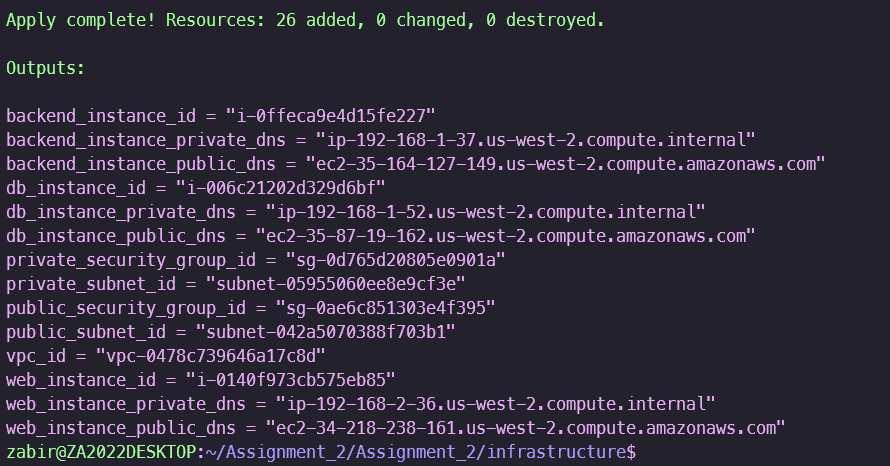
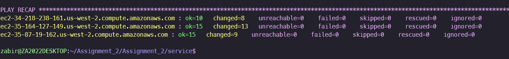
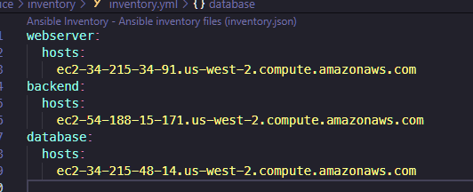
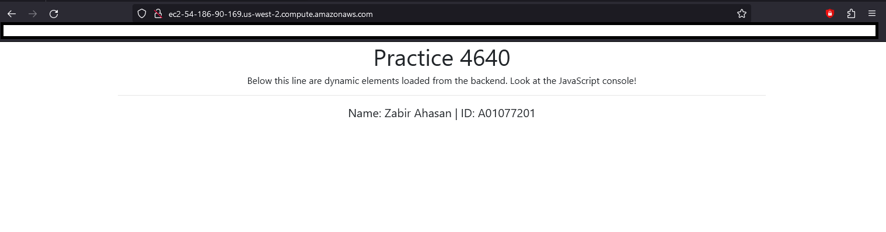

# Assignment 2 

### Project Overview
The goal of this Assignment is to provision an infrastructure and deploy a web application across different EC2 Server instances, using AWS, Terraform and Ansible.  

#### The primary infrastructure is created by Terraform and consists of:

- VPC 
- 2 Subnets:
  - Public & Private 
- Gateway
- Route Table & Associations
  - Public & Private 
- 2 Security Groups:
  - Public & Private - With their own rules 
- 3 EC2 Instances:
  - webserver
  - backend
  - database

The application (*https://github.com/timoguic/acit4640-py-mysql.git*) is deployed using a Ansible playbook file `web_app.yml` that uses configuration the application files as jinja2 templates, `group_variables.yml` and `inventory.yml` files are generated by the `ec2.tf` file.

Running the playbook requires `ansible.cfg` file to be configured for ssh connections to the EC2 instances and declaring the inventory variable. The inventory file is a grouped list of all the hosts with DNS addresses.

#### The playbook contains plays and tasks:

- Update and install basic packages on all hosts

  - Update OS package list
  - Install common packages

- Configure Database Server
  - Install MySQL server and python3-pymysql
  - Configure MySQL to listen on private IP
  - Start and enable MySQL service
  - Remove anonymous user accounts
  - Remove test database
  - Create application database
  - Create application user & grant all privileges
  - Create table for the app & insert data
  - Remove remote root
  - Set Root Password
  - restart mysql (handler)

- Config Backend Application Server
  - Install packages for backend server
  - Create group for application
  - Create OS user for application
  - Clone application repository
  - Copy the backend directory to the desired location
  - Ensure backend user owns the backend directory
  - Pip install requirements
  - Copy over backend conf file
  - Create systemd service file
  - Enable & start service
  - reload & restart (handler)

- Configure Webserver
  - Install Nginx & Git
  - Create web root dir
  - Configure Nginx
  - Clone repository on webserver
  - Copy to web root location
  - restart nginx (handler)

## Requirements & Prerequisites

- AWS account with Admin privileges:
  - https://docs.aws.amazon.com/accounts/latest/reference/welcome-first-time-user.html#getting-started-step1
  - https://docs.aws.amazon.com/SetUp/latest/UserGuide/setup-createadminperms.html

- AWS CLI configured:
  - https://docs.aws.amazon.com/cli/latest/userguide/getting-started-install.html

- Terraform and Ansible installed:
  - https://developer.hashicorp.com/terraform/tutorials/aws-get-started/install-cli
  - https://docs.ansible.com/ansible/latest/installation_guide/intro_installation.html

### Configuration & Mandatory File Changes

- Change values in the following files and fields: 

    1. `terraform.tfvars`:

    - home_net = "<Your Home IP Address>"
    - ssh_key_name = "<You SSH Key Name>"

    2. `ansible.cf`:
    
    - private_key_file = <SSH KEY PATH>

## Assignment Files & Directory Content:

- `infrastructure` directory:

    - `ec2.tf` - EC2 Instances (web, database & backend) servers & writes Ansible Host list/group + variables for playbook files

    - `outputs.tf` - Output of resources created

    - `provider.tf` - Provider information for Terraform & version

    - `terraform.tfvars` - Input Variables for infrastructure resources (Used in `ec2.tf` & `vpc.tf`)

    - `vpc.tf` - VPC; required infrastructure resources

- `service` directory:

    - `group_vars` directory - will be empty during initial setup 

    - `inventory` directory - will be empty during initial setup

    - `templates` directory - contains all the configuration files for backend and web server

        - `backend.conf.j2` - configuration file for backend + db 

        - `backend.service.j2` - systemd service file for backend server

        - `nginx.conf.j2` - nginx config file for webserver 

    - `ansible.cfg` - ansible configuration

    - `web_app.yml` - playbook file; deploys application to the EC2 Instance servers (contains list of tasks for each server)

# Usage / Instructions:

## 1. Setup Infrastructure

#### Terraform Basic Commands: 
https://developer.hashicorp.com/terraform/cli/commands

- Navigate to the `infrastructure` directory

- Initialize Terraform:
  - *terraform init* - Initializes the Terraform environment

- Plan Infrastructure (Optional):
   - *terraform plan* - Displays the resources that will be created

- Apply the Terraform configuration:
   - *terraform apply* - Creates the resources and generates group_vars/group_variables.yml and inventory/inventory files.

    

## 2. Deploy Web Application

#### Ansible Basic Commands:
https://docs.ansible.com/ansible/latest/command_guide/cheatsheet.html

- Navigate to the `service` directory

- Run the Ansible playbook
  - *ansible-playbook -i inventory web_app.yml* - Deploys the application and services to the EC2 instances

    

## 3. Access the Web Application
- Retrieve the webserver host's DNS address from the `inventory\inventory.yml` file

    
    
- Open a web browser and enter the DNS address

    

## 4. Clean up
- Return to the `infrastructure` directory
- Remove / destroy the created resources:
  - *terraform destroy* - Tears down all resources created by Terraform
